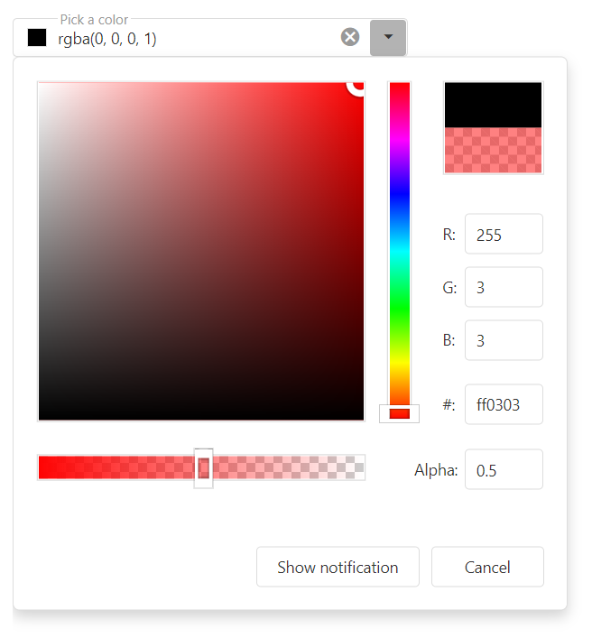

<!-- default badges list -->

<!-- default badges end -->
# DevExtreme ColorBox - Getting Started 

This repository stores the code examples of the ColorBox component for the [Getting Started with ColorBox](https://js.devexpress.com/Documentation/Guide/UI_Components/ColorBox/Getting_Started_with_ColorBox/) tutorial. This tutorial explains how to create a ColorBox, configure its values, customize buttons and labels, and handle value changes.

## Files to Review

- **Angular**
    - [app.component.html](Angular/src/app/app.component.html)
    - [app.component.ts](Angular/src/app/app.component.ts)
- **jQuery**
    - [index.js](jQuery/src/index.js)
- **React**
    - [App.tsx](React/src/App.tsx)
- **Vue**
    - [App.vue](Vue/src/App.vue)
    - [ColorBoxContent.vue](Vue/src/components/ColorBoxContent.vue)

## Documentation

- [Getting Started with ColorBox](https://js.devexpress.com/Documentation/Guide/UI_Components/ColorBox/Getting_Started_with_ColorBox/)

- [ColorBox - API Reference](https://js.devexpress.com/Documentation/ApiReference/UI_Components/dxColorBox/)
<!-- feedback -->
## Does This Example Address Your Development Requirements/Objectives?

 

(you will be redirected to DevExpress.com to submit your response)
<!-- feedback end -->
